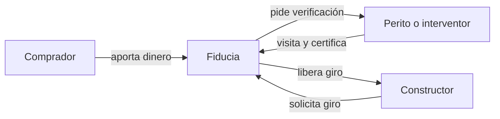

# Problem Brief — Semana 1

## Decisión del problema

### Problema elegido

Las fiduciarias y los bancos liberan el dinero de los proyectos de vivienda según un avance de obra que se verifica con visitas manuales esporádicas y certificaciones del propio constructor, sin una evidencia objetiva que todas las partes puedan comprobar.

**Propuesto por:** [Juan Jose Carabali](https://github.com/SrDri)

### Por qué elegimos este

- **Varias partes que no confían entre sí comparten información crítica:** constructor, fiduciaria, banco, interventor y compradores dependen del mismo dato (cuánto avanzó la obra) y cada uno tiene incentivos distintos.
- **El histórico no puede alterarse:** los certificados de avance sustentan giros de dinero y son evidencia en caso de disputa, por lo que su integridad en el tiempo es crítica.
- **Hay dinero real en juego y un pagador claro:** el flujo mueve recursos significativos y la verificación ya se paga hoy (peritos, interventoría).
- **Encaja con las capacidades del equipo:** experiencia en visión artificial y desarrollo full-stack.

### Propuestas descartadas

| Propuesta | Propuesta por | Motivo del descarte |
|---|---|---|
| Evidencia de "libre de deforestación" para exportaciones de café y cacao | [Juan Carabali](https://github.com/SrDri) | Mercado concurrido, obligación legal en el importador europeo y alta incertidumbre regulatoria. |
| Identidad biométrica del ganado para crédito y seguros | [Juan Carabali](https://github.com/SrDri) | No se encontró disposición a pagar validada en Colombia y los Estados están estandarizando la identificación con chips. |
| Verificación de toneladas recicladas para la ley de envases | [Juan Carabali](https://github.com/SrDri) | La verificación ya la cubren certificadores acreditados y planes colectivos; la parte visual es secundaria. |

---

## Problem Brief

### Encabezado

**Proyecto:** Tramo.
**En una frase:** El dinero de los proyectos de vivienda se libera según avances de obra que nadie puede verificar de forma objetiva e independiente.

### Equipo y roles

| Integrante | Usuario de GitHub | Rol |
|---|---|---|
| Juan Jose Carabali | [@SrDri](https://github.com/SrDri) | Líder del proyecto, visión artificial y validación con usuarios |

- **Responsable de las entregas:** [Juan Jose Carabali](https://github.com/SrDri)

### Problema y evidencia

**Enunciado:** Las fiduciarias y los bancos liberan el dinero de los proyectos de vivienda según un avance de obra que se verifica con visitas manuales esporádicas y certificaciones del propio constructor, sin una evidencia objetiva que todas las partes puedan comprobar.

**Contexto y alcance.** En Colombia, la mayoría de los proyectos de vivienda sobre planos canalizan el dinero de los compradores a través de una fiducia. Según la Unidad de Regulación Financiera, la fiducia inmobiliaria administra COP 116,82 billones en 7.706 negocios, con datos a junio de 2025 ([URF](https://www.urf.gov.co/documents/283253/0/003_DT_Negocio+Fiduciario.pdf/7c110cdf-c3c4-3fdf-f38f-bddc1339ab4f?t=1764374530885)). Además, el crédito constructor se desembolsa por tramos contra avance de obra.

**Frecuencia.** El problema se repite en cada desembolso de cada proyecto: los bancos hacen desembolsos parciales según el avance constatado en las visitas del perito ([Bancolombia](https://www.bancolombia.com/personas/creditos/vivienda/credito-hipotecario-para-construccion)).

**Evidencia de que el problema existe:**

- En algunas fiducias de administración y pagos, la fiduciaria solo exige al constructor una certificación semestral sobre el uso de los recursos ([Ámbito Jurídico](https://www.ambitojuridico.com/noticias/mercantil/financiero-cambiario-y-seguros/fiduciarias-deben-verificar-la-destinacion-de)).
- Se reportan 118 demandas contra fiducias inmobiliarias en 13 años, con pretensiones por COP 3,1 billones ([Portafolio](https://www.portafolio.co/economia/infraestructura/senalan-cuatro-factores-para-mejorar-las-fiducias-inmobiliarias-y-asi-evitar-afectaciones-a-los-clientes-499180)).
- El Gobierno reforzó la regulación con el Decreto 510 de 2026, que obliga a las fiduciarias a verificar que el constructor tenga un contrato de interventoría independiente ([La República](https://www.larepublica.co/finanzas/el-gobierno-nacional-expidio-un-nuevo-decreto-que-regulara-los-negocios-fiduciarios-4396448)).
- **Pendiente:** entrevistas con peritos, interventores y fiduciarias para confirmar el problema con observación directa.

### Usuario y actores

**Usuario principal: la fiduciaria o el banco que libera los giros.** Necesita decidir cuándo desembolsar con la seguridad de que el avance reportado es real, y contar con evidencia que resista una auditoría o una demanda.

**Cómo lo resuelve hoy y qué le cuesta.** Contrata o exige visitas de perito o supervisor que constaten el avance antes de cada desembolso. En algunos bancos, las tarifas de esas visitas están preestablecidas y las asume el titular del crédito ([BBVA](https://www.bbva.com.co/personas/productos/prestamos/vivienda/construccion-de-vivienda.html)). En otros, el avance lo define un equipo técnico propio del banco ([Banco de Bogotá](https://www.bancodebogota.com/empresas/productos-de-credito/credito-constructor)). Le cuesta en:

- **Dinero:** peritos, interventoría y equipos técnicos.
- **Tiempo:** coordinar visitas retrasa los giros.
- **Riesgo:** la evidencia queda dispersa en informes y fotos sin trazabilidad.

**Demás actores:**

| Actor | Papel en el flujo |
|---|---|
| Comprador de vivienda | Aporta el dinero a la fiducia y espera recibir su vivienda. |
| Constructor | Ejecuta la obra y solicita los giros. |
| Interventor o perito | Constata el avance y certifica o recomienda el giro. |
| Fiduciaria | Administra los recursos y autoriza los pagos. |
| Banco (crédito constructor) | Financia la obra por tramos contra avance. |
| Superintendencia Financiera | Vigila a fiduciarias y bancos. |

### Flujo actual de valor

1. **El comprador separa su vivienda** y consigna sus aportes en el encargo fiduciario del proyecto.
2. **La fiduciaria administra los recursos.** Esta figura está vigilada por la Superintendencia Financiera (**paso normativo**).
3. **El constructor alcanza las condiciones para recibir recursos** (punto de equilibrio y licencias) y empieza a solicitar giros o desembolsos del crédito constructor.
4. **Se programa una verificación:** un perito del banco o el interventor visita la obra, toma fotos y elabora un informe de avance. Con el Decreto 510 de 2026, la fiduciaria debe verificar que exista una interventoría independiente (**paso normativo**).
5. **El informe llega a la fiduciaria o al banco**, que lo revisa y aprueba el giro.
6. **Se libera el dinero al constructor**, y el ciclo se repite en el siguiente corte de obra.
7. **Cada parte guarda la evidencia en su propio sistema** (correos, PDFs, fotos), sin un registro común.

### Fricciones identificadas

| # | Paso | Fricción | Causa | A quién afecta |
|---|---|---|---|---|
| F1 | 4 | Verificaciones esporádicas y lentas | Dependen de visitas presenciales que hay que coordinar; entre visitas no hay visibilidad | Constructor (giros demorados), banco o fiduciaria (riesgo) |
| F2 | 4–5 | Evidencia débil o autodeclarada | En algunos casos se acepta la certificación del propio constructor; las fotos no prueban lugar ni fecha | Fiduciaria, compradores |
| F3 | 7 | Evidencia dispersa y modificable | Cada actor guarda su versión en sistemas propios; un informe o una foto pueden cambiarse o antedatarse | Todos, sobre todo en disputas |
| F4 | 4 | Costo de verificación | Honorarios de peritos, interventoría y equipos técnicos | Constructor y titular del crédito, que suelen asumir el costo |
| F5 | 5–6 | Desconfianza entre partes | El constructor quiere el giro rápido y la fiduciaria quiere minimizar el riesgo; no hay una fuente de verdad compartida | Relación constructor–fiduciaria–compradores |

Las fricciones se refuerzan entre sí: como la evidencia es débil y dispersa (F2 y F3), la única forma de ganar confianza es visitar la obra más seguido, lo que encarece y demora el proceso (F1 y F4). Cuando un proyecto fracasa, no hay una versión única de lo ocurrido y el conflicto termina en demandas (F5).

### Oportunidad e hipótesis

**Oportunidad priorizada: F3, evidencia dispersa y modificable (en conjunto con F2).**

La elegimos porque es la raíz de las demás fricciones. Si la evidencia del avance fuera objetiva, verificable y compartida:

- Las visitas podrían ser menos frecuentes (F1 y F4).
- La desconfianza se reduciría (F5).
- En caso de disputa, habría una prueba sólida en lugar de versiones contradictorias.

También es la fricción donde el equipo puede aportar más: la visión artificial permite medir el avance a partir de imágenes, y un registro compartido permite asegurar esa evidencia.

**Hipótesis inicial.** Si cada corte de obra genera un certificado de avance (fotos geolocalizadas, medición del avance y firma del interventor) cuya huella digital se sella en un registro distribuido, entonces:

- **Para la fiduciaria o el banco:** podrá aprobar giros con evidencia que nadie puede alterar después, reduciendo su exposición en auditorías y demandas.
- **Para el constructor:** recibirá los giros más rápido, porque la evidencia está disponible al momento y no depende solo de coordinar una visita.
- **Para el comprador:** podrá comprobar por sí mismo que el avance reportado existe y no ha sido modificado.

### Criterio de pertinencia

**¿Por qué no basta una base de datos tradicional?** Porque el problema no es solo guardar la evidencia, sino que todas las partes puedan confiar en que nadie la modificó. Si la evidencia vive en la base de datos del constructor, la fiduciaria debe confiar en el constructor. Si vive en la de la fiduciaria, el comprador debe confiar en la fiduciaria. Cualquier administrador de una base de datos central puede, en principio, editar o antedatar un registro.

**Criterios de la Sesión 1 que aplican:**

1. **Varias partes que no confían entre sí necesitan compartir un mismo registro.** Constructor, fiduciaria, banco, interventor y compradores tienen intereses distintos (y a veces opuestos) sobre el mismo dato: el avance real de la obra.
2. **El histórico no puede alterarse.** Los certificados sustentan desembolsos y son evidencia en disputas; un registro con sellos de tiempo inmutables impide antedatar o modificar informes.

**¿Y una integración entre los sistemas existentes?** Conectar los sistemas de cada actor movería la información más rápido, pero no resolvería quién tiene la versión válida ni evitaría que alguien edite su copia. El registro distribuido aporta una referencia neutral que ningún actor controla.

**Alcance honesto.** No proponemos eliminar a la fiduciaria ni poner los pagos en contratos inteligentes; la fiduciaria seguirá girando desde sus sistemas regulados. El registro distribuido cumple un papel específico: sellar la huella digital de la evidencia (no las fotos completas) para que su integridad sea verificable por cualquiera. Las imágenes y el análisis quedan fuera de la cadena.

### Supuestos y riesgos

**Supuestos que tendrían que ser ciertos:**

1. **Las fiduciarias y los bancos valoran una evidencia independiente y verificable** lo suficiente como para aceptarla como soporte de los giros, o para exigirla al constructor.
2. **Es posible medir el avance de obra a partir de imágenes con precisión suficiente** (objetivo inicial: diferencia de ±5 puntos porcentuales respecto al interventor humano) en proyectos de vivienda típicos.
3. **Los actores aceptan capturar la evidencia de forma estandarizada** (por ejemplo, el residente de obra con una app), sin que eso agregue mucha carga a su trabajo.

**Qué podría invalidar la hipótesis:**

- **Responsabilidad legal:** que las fiduciarias solo acepten la firma de un ingeniero con matrícula y vean el sellado como irrelevante. En ese caso, la solución pasaría a ser una herramienta de apoyo al interventor.
- **Evidencia falsa desde el origen:** sellar una foto no prueba que sea verdadera. Si no se valida la evidencia antes de sellarla (lugar, fecha, manipulación), el registro inmutable solo conservaría errores.
- **Adopción:** que ningún actor quiera asumir el costo, o que la regulación no llegue a reconocer este tipo de evidencia.
- **Competencia:** que plataformas existentes de seguimiento de obra agreguen funciones para financiadores antes que nosotros.
