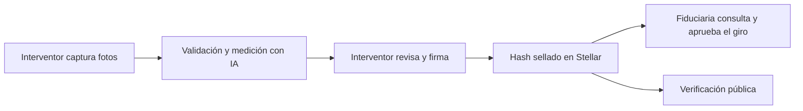
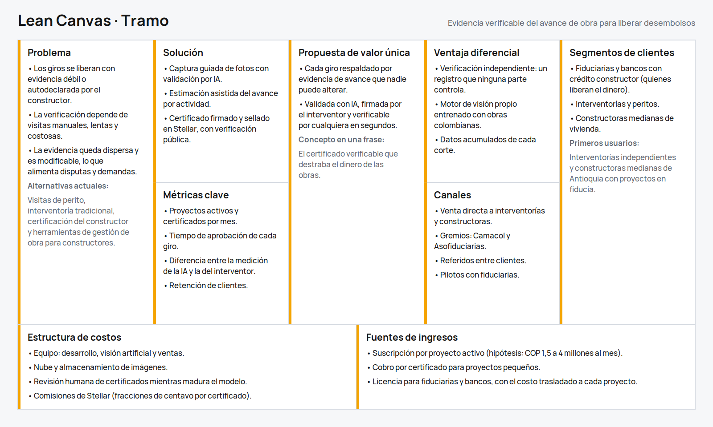
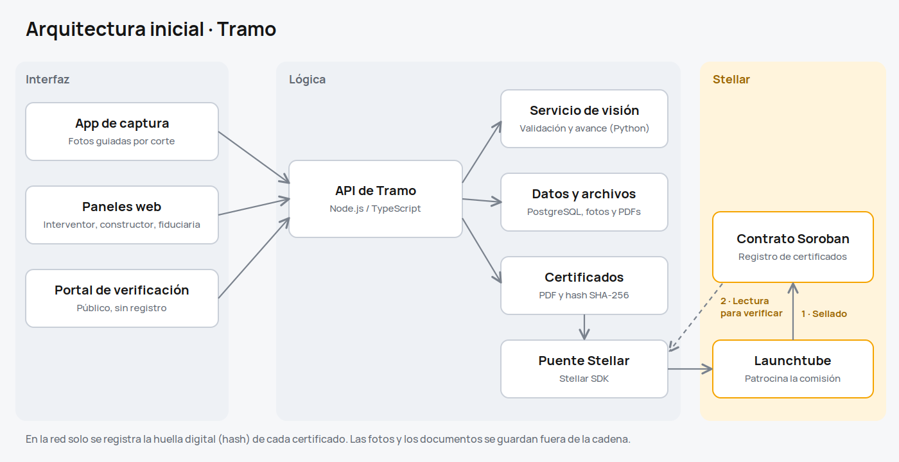

# Product Blueprint

**Nombre del proyecto:** Tramo

**Repositorio (enlace obligatorio):** [BB101_project](https://github.com/SrDri/BB101_project)

---

## Contenido

1. Priorización de historias
2. Propuesta de valor
3. Flujo de usuario
4. Alcance del MVP
5. Lean Canvas
6. Backlog priorizado (Kanban)
7. Arquitectura inicial
8. Uso de Stellar y justificación

---

## 1. Priorización de historias

**Criterio de priorización:** Usamos la escala *imprescindible / debería / podría / queda fuera* con una pregunta guía: **¿sin esta historia se rompe el recorrido de la evidencia, desde la obra hasta quien libera el dinero?** Si se rompe, es imprescindible. Si el recorrido funciona pero pierde valor importante, es "debería". Lo demás se pospone.

| Prioridad | Historia | Propuesta por | Por qué entra al backlog |
| :---: | --- | :---: | --- |
| 1 | Como interventor de obra quiero revisar, corregir y firmar el certificado de avance para avalar lo que se reporta y que quede sellado sin posibilidad de cambios. | [Juan Carabali](https://github.com/SrDri) | **Imprescindible.** Es el núcleo: convierte evidencia en un certificado firmado e inalterable. |
| 2 | Como cualquier interesado quiero verificar un certificado subiendo el archivo o abriendo su enlace para comprobar que no fue alterado ni antedatado. | [Juan Carabali](https://github.com/SrDri) | **Imprescindible.** Demuestra el valor del sello en Stellar para todas las partes. |
| 3 | Como interventor de obra quiero capturar fotos guiadas por piso o frente, con ubicación, fecha y hora registradas automáticamente, para documentar el avance. | [Juan Carabali](https://github.com/SrDri) | **Imprescindible.** Sin captura confiable no hay evidencia que certificar. |
| 4 | Como analista de una fiduciaria quiero consultar el certificado de cada corte junto con su evidencia para decidir si apruebo el giro. | [Juan Carabali](https://github.com/SrDri) | **Debería.** Es el usuario principal del Problem Brief: quien libera el dinero. |
| 5 | Como interventor de obra quiero recibir una estimación del avance por actividad calculada a partir de las fotos para preparar el informe en menos tiempo. | [Juan Carabali](https://github.com/SrDri) | **Debería.** Es el diferenciador; en el MVP empieza como estimación asistida que el interventor ajusta. |
| 6 | Como constructor quiero ver el estado de verificación de cada corte para saber cuándo tendré listo el soporte del giro. | [Juan Carabali](https://github.com/SrDri) | **Podría.** Mejora la experiencia, pero no bloquea el flujo central. |

*Queda fuera por ahora: el portal del comprador de vivienda, que depende de que el flujo interventor–fiduciaria funcione primero.*

---

## 2. Propuesta de valor

**Usuario (del Problem Brief):** La fiduciaria o el banco que libera los giros de un proyecto de vivienda, junto con el interventor que verifica el avance.

**Resultado que obtiene:** Por cada corte de obra recibe un certificado de avance con fotos validadas, medición del avance por actividad y la firma del interventor, sellado en una red pública. Puede aprobar el giro sabiendo que la evidencia es real, que corresponde a esa obra y esa fecha, y que nadie podrá modificarla después.

**Por qué elegiría esta solución:** Porque reduce su riesgo en cada desembolso, le ayuda a cumplir la exigencia de interventoría independiente del Decreto 510 de 2026 y le da una prueba sólida si un proyecto termina en disputa. Además, no cambia su proceso ni le cuesta: el certificado se suma como soporte del giro y su costo lo asume cada proyecto, como hoy ocurre con las visitas de perito. Para el interventor, la captura guiada y la medición asistida reducen el tiempo de preparar cada informe.

**En qué se diferencia de cómo lo resuelve hoy:** Hoy la verificación depende de visitas esporádicas, informes en PDF y fotos sueltas guardadas en el correo o el servidor de cada actor, y a veces solo de una certificación del propio constructor. Con Tramo la evidencia se valida antes de certificarse, queda en un solo registro que ninguna de las partes controla y cualquiera puede comprobar su integridad en segundos.

---

## 3. Flujo de usuario

| Paso | Rol | Qué hace | Punto de interacción |
| :---: | :---: | --- | --- |
| 1 | Interventor | Abre el corte de obra del proyecto y sigue la ruta guiada de fotos por piso o frente. | App móvil (captura) |
| 2 | Sistema | Registra ubicación, fecha y hora; valida que las fotos no estén editadas ni repetidas, y difumina rostros. | Servidor (servicio de visión) |
| 3 | Sistema | Estima el avance por actividad y lo compara con el cronograma del proyecto. | Servidor (servicio de visión) |
| 4 | Interventor | Revisa la estimación, corrige lo necesario y firma el certificado. | Panel web del interventor |
| 5 | Sistema | Genera el certificado, calcula su huella digital (hash) y la registra en el contrato de Tramo, pagando la comisión por el usuario. | Red Stellar (contrato Soroban) |
| 6 | Constructor | Ve que el corte quedó certificado y adjunta el enlace del certificado a su solicitud de giro. | Panel web del constructor |
| 7 | Analista de la fiduciaria | Abre el certificado, revisa la evidencia y la confirmación del sello, y aprueba el giro en su propio sistema. | Panel web de la fiduciaria |
| 8 | Cualquier interesado | Sube el archivo del certificado o abre su enlace y confirma que coincide con lo registrado en la red. | Portal público de verificación |

Ningún usuario necesita billetera ni criptomonedas: Tramo patrocina las transacciones. La fiduciaria sigue liberando el dinero desde sus sistemas; Tramo nunca toca los recursos.

---

## 4. Alcance del MVP

| Dentro del MVP (funcionalidad central) | Fuera del MVP (deseable, para después) |
| --- | --- |
| Captura web/móvil de fotos por corte con ubicación, fecha y hora | Vuelos de dron, cámaras fijas y fotogrametría 3D |
| Validación básica de imágenes (metadatos, duplicados) y difuminado de rostros | Comparación automática contra modelos BIM |
| Estimación asistida del avance por actividad, que el interventor ajusta | Medición totalmente automática de todas las actividades |
| Certificado firmado por el interventor con hash sellado en Stellar | Firma con passkeys y credenciales verificables del interventor |
| Portal público de verificación de certificados | Portal del comprador con alertas |
| Vista de certificados por proyecto para la fiduciaria | Integración directa con los sistemas de la fiduciaria y liberación automática de giros |

**Por qué el recorte sigue entregando valor:** El MVP cubre el recorrido completo de la evidencia: se captura en obra, se valida, se mide, se firma, se sella y cualquier parte la puede verificar. Eso es exactamente lo que falta hoy, según el Problem Brief: una evidencia objetiva y común que nadie pueda alterar. Lo que queda fuera mejora la precisión o la comodidad (drones, BIM, medición totalmente automática, integraciones), pero no cambia la promesa central. Además, mantener al interventor en el ciclo de revisión es una decisión deliberada: reduce el riesgo de errores del modelo, respeta su responsabilidad profesional y produce los datos para mejorar la IA con cada corte.

---

## 5. Lean Canvas

**Enlace al Lean Canvas:** [Lean Canvas de Tramo](https://github.com/SrDri/BB101_project/blob/main/docs/semana2/assets/lean-canvas.png)

---

## 6. Backlog priorizado (Kanban)

**Enlace al tablero:** [Tablero Kanban de Tramo en GitHub Projects](https://github.com/users/SrDri/projects/1)

---

## 7. Arquitectura inicial

**Diagrama:**

| Capa | Componente | Qué hace |
| :---: | --- | --- |
| Interfaz | App web/móvil (TypeScript) | Captura guiada de fotos, paneles del interventor, el constructor y la fiduciaria, y portal público de verificación. |
| Lógica | API (Node.js / TypeScript) con base de datos y almacenamiento de archivos | Gestiona proyectos, cortes y usuarios; guarda fotos y certificados; genera el certificado y calcula su hash SHA-256. |
| Lógica | Servicio de visión (Python) | Valida imágenes, difumina rostros y estima el avance por actividad. |
| Lógica | Puente con Stellar (Stellar SDK) | Construye las transacciones, las firma con la llave del servicio y las envía patrocinadas a través de Launchtube. |
| Stellar | Contrato Soroban "registro de certificados" (Rust) | Guarda el hash de cada certificado con proyecto, corte, fecha y firmante, impide sobrescribirlo y permite consultar el historial. |

**En qué punto entra la red:** Stellar entra en dos momentos. Primero, cuando el interventor firma el certificado: el puente registra su hash en el contrato Soroban. Segundo, cuando alguien verifica: el portal recalcula el hash del archivo y lo compara con el registrado en la red. Las fotos, los informes y los datos del proyecto nunca se suben a la blockchain; viven en el almacenamiento de Tramo, y en la red solo queda la huella digital que prueba que no han cambiado.

---

## 8. Uso de Stellar y justificación

**Criterio de pertinencia (del Problem Brief):** Varias partes que no confían entre sí (constructor, fiduciaria, banco, interventor y compradores) necesitan compartir un mismo registro, y el histórico de la evidencia no puede alterarse ni antedatarse.

| Componente de Stellar | Para qué lo usamos | Por qué ese y no otra alternativa |
| --- | --- | --- |
| Soroban (contratos inteligentes, en Rust) | Contrato "registro de certificados": guarda el hash, el proyecto, el corte, la fecha y el firmante, e impide sobrescribir un certificado ya registrado. | Escribir solo el hash en el memo de una transacción prueba existencia, pero no permite reglas ni consultar el historial de un proyecto. El contrato hace explícitas las reglas del registro y las deja auditables por cualquiera. |
| Stellar SDK (JavaScript) | Conectar el backend con la red: construir, firmar y consultar transacciones y el estado del contrato. | Es la librería oficial para TypeScript, el lenguaje del resto del producto. |
| Launchtube | Patrocinar y enviar las transacciones para que interventores y fiduciarias no necesiten billetera ni criptomonedas. | Nuestros usuarios no son usuarios cripto; pedirles una billetera mataría la adopción. Patrocinar las comisiones mantiene la experiencia de una aplicación normal. |
| Red pública de Stellar | Dar una referencia neutral que ninguna de las partes controla. | Las comisiones son de fracciones de centavo y las transacciones se confirman en segundos, lo que permite sellar cada certificado a un costo despreciable. Una base de datos de cualquier actor exigiría que los demás confiaran en él. |

**A futuro:** usaremos passkeys para que el interventor firme cada certificado con la biometría de su teléfono, lo que hará la firma atribuible a una persona sin que maneje claves privadas.
